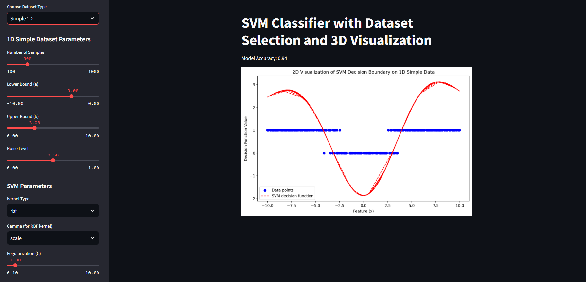
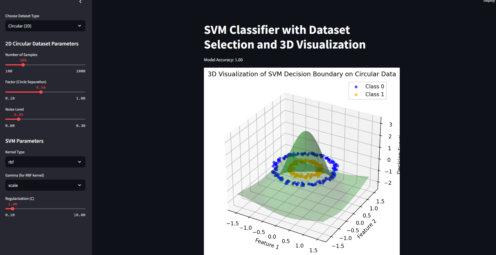
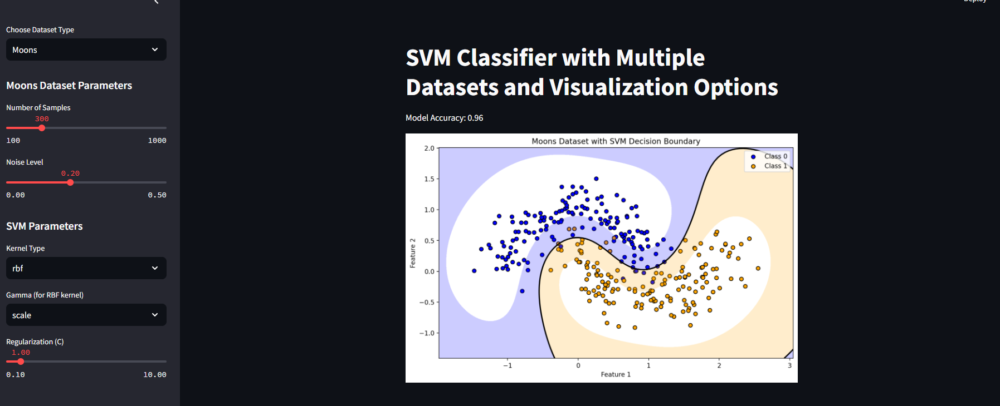
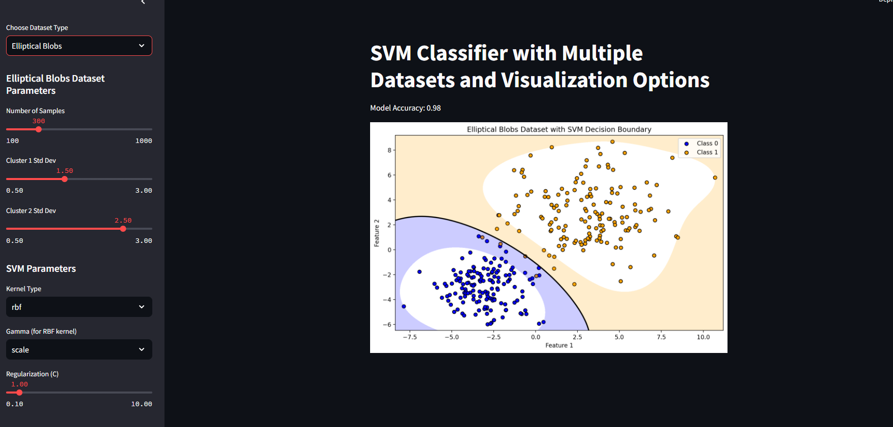

# SVM Classifier with Streamlit Visualization

This project implements and visualizes a Support Vector Machine (SVM) classifier on different types of datasets using a Streamlit web application. The application allows users to interactively explore the performance of SVM on various datasets, adjust parameters, and visualize the decision boundaries in 2D and 3D.

---

## Project Structure

The project is divided into three main parts, corresponding to HW3-1, HW3-2, and HW3-3.

### HW3-1: 1D Comparison Between Logistic Regression and SVM
This section demonstrates the differences in performance between **Logistic Regression** and **SVM** on a custom 1D dataset. A simple 1D dataset is created with a non-linear boundary, where SVM's ability to handle non-linear separations leads to better accuracy than Logistic Regression.

#### Features
- Generates a 1D dataset with custom boundaries.
- Compares the decision boundaries of Logistic Regression and SVM.
- Visualizes the performance in 1D.

### HW3-2: 2D SVM with Streamlit Deployment and 3D Visualization
This section extends the visualization to a **2D circular dataset** with an interactive Streamlit app. Users can adjust dataset parameters and SVM hyperparameters, with a 3D visualization of the decision boundary.

#### Features
- **Circular Dataset (2D)** with adjustable parameters: number of samples, circle separation, and noise.
- **3D Visualization** of the SVM decision boundary on circular data.
- Allows interactive tuning of SVM hyperparameters (kernel type, gamma, and regularization).

#### Example Screenshot



### HW3-3: Multiple 2D Datasets with Non-Circular Distributions
In this section, the application is extended to include multiple dataset types that require non-linear decision boundaries. The supported datasets are **Moons**, **Spiral**, and **Elliptical Blobs**, each with unique shapes that demonstrate SVM’s ability to handle complex boundaries.

#### Features
- **Dataset Types**:
  - **Moons Dataset**: Two interlocking half-moons, ideal for testing non-linear decision boundaries.
  - **Spiral Dataset**: Creates two spiraling classes, challenging for traditional linear classifiers.
  - **Elliptical Blobs Dataset**: Generates clusters with elliptical shapes, suitable for non-linear classification.
- **Contour Plots**: The decision boundaries are displayed as contour plots for 2D datasets.
- **Interactive Controls**: Adjustable parameters for each dataset type, as well as SVM hyperparameters.

#### Example Screenshots
- Moons Dataset:
  

- Spiral Dataset:
  

- Elliptical Blobs Dataset:
  

---

## Usage

1. Clone the repository:
   ```bash
   git clone https://github.com/yourusername/svm-visualization.git
   ```
2. Install the required packages:
   ```bash
   pip install -r requirements.txt
   ```
3. Run the Streamlit app:
   ```bash
   streamlit run app.py
   ```
4. Open your browser to view the app at `http://localhost:8501`.

---

## How to Use the App

1. **Choose Dataset Type**: Select one of the dataset types (Circular, Simple 1D, Moons, Spiral, or Elliptical Blobs) from the dropdown menu.
2. **Adjust Dataset Parameters**: Each dataset type has its own unique parameters for customization, such as sample size, noise level, and other shape-specific parameters.
3. **Adjust SVM Parameters**: Modify the SVM hyperparameters (kernel type, gamma, regularization `C`) to see how they affect the decision boundary.
4. **View Visualization**: Depending on the dataset type, you can see the decision boundary in 2D or 3D.

---

## Implementation Details

- **SVM Model**: The SVM classifier is implemented using `sklearn.svm.SVC`. Different kernels (linear, RBF, polynomial) can be applied to handle various dataset shapes.
- **Streamlit Framework**: Provides an interactive UI to control parameters and visualize the SVM decision boundaries dynamically.
- **Matplotlib**: Used for plotting the decision boundaries in 2D and 3D.

---

## Requirements

- Python 3.7+
- `streamlit`
- `numpy`
- `matplotlib`
- `sklearn`

---

## License

This project is licensed under the MIT License. See `LICENSE` for more details.

---

## Acknowledgments

This project was developed as part of a homework assignment to explore SVM classification and decision boundary visualization. It demonstrates SVM's versatility in handling various dataset shapes and the power of interactive visualization.
